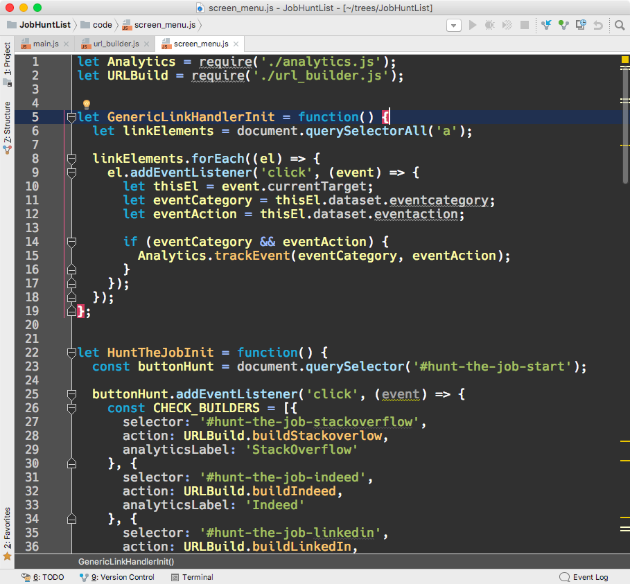

# KATCool2 Color Theme

This is my artisanal, hand-crafted, dark color theme for use in the amazing dev tools 
by [JetBrains](http://www.jetbrains.com/). 

I'm a programmer, and I use this color theme while I'm writing code all day. 

Over the years I've used [PHPStorm](https://www.jetbrains.com/phpstorm/), [RubyMine](https://www.jetbrains.com/ruby/), [InteliJ](https://www.jetbrains.com/idea/), and usually reach for [WebStorm](https://www.jetbrains.com/webstorm/) the most. I'm looking forward to [PyCharm](https://www.jetbrains.com/pycharm/) as I jump into Python and [machine learning](https://www.slideshare.net/KaDawg/machine-learning-understanding-the-invisible-force-changing-our-world).

I've honed my color scheme over the years as new languages come out, my programming environment changed, and my tastes evolve. No doubt the color choices are influenced by dozens of fantastic dark-colored themes I've discovered in the past, but I don't have any particular references to note. This one is my responsibility. 

Please give it a try! Find out if it's helpful. If you come to like it please pass on a kind word about it to your friends and teammates!

* Ping me on Twitter [@KenTabor](https://twitter.com/kentabor) to talk about this.
* Check out my [technical blog](http://blog.katworksgames.com/) for the latest on frontend engineering, UX, and leadership.

## Samples

JavaScript looks like this with my color scheme!

Sass looks like this with my color scheme!

## Supported Languages 

This color theme supports just about all of the web-centric, full-stack, programming languages. For sure the ones particularly *Ken-centric* including:

* JavaScript, HTML, CSS, SCSS/Sass, LESS, JSON
* NodeJS, Ruby, PHP
* Apache Config, Regex, SQL, Cucumber, Database
* ERB, EJS, Jade, HAML, XML, YAML

This list has grown over the years, and I expect it to keep growing.

## Refactoring

Over the years I found each JetBrains IDE used it's own `.xml` file formatted specifically for its own need. Over the years they switched to what I think is a single, all-inclusive, multi-use format stored in a `.icls` file. 

For that reason I've removed all legacy references to supporting individual IDEs. 

You'll only discover one file here now: [`KATzCool.icls`](KATzCool2.icls), and I expect you'll use it well in your particular choice of JetBrains IDEs.

# Installing 

Nothing formal. Copy my color theme file [`KATzCool.icls`](KATzCool2.icls) to a subdirectory on your machine. The main filepath changes based on your IDE of choice. 

## Installing for OSX
Installing my color theme is easy. Drop it into the config sub-directory created by your IDE. 

On **OSX** that looks typically like this:

* `/Users/ken/Library/Preferences/RubyMine2016.3/colors`
* `/Users/ken/Library/Preferences/PyCharm2017.2/colors`
* `/Users/ken/Library/Preferences/WebStorm2017.2/colors`

Your situation will vary depending on what IDE and what build you have installed.

## Installing for Windows
I no longer keep a daily MS Windows dev machine. Not sure where JetBrains IDEs are stored on that environment. If you poke around your file system a bit I bet you figure it out.

# App Setting
You'll need to tell your IDE to start using my Color scheme.

Restart your IDE if it was running while you copied over my color theme file.

Change the color scheme in your IDE preference dialog box.

# Favorite Fonts
This doesn't have anything to do with color schemes, but it's a bonus topic just for fun!

I'm picky about what programmer's editor I use, and even more picky about my font. I hope you are too. Excellent tools make us better at our craft. 

Check out the one I'm using, and see if it'll help you better read your code.

## Hack

This represents my ideal font for code. Install it now. 

[Hack Programmer's Font](http://sourcefoundry.org/hack/)

## Bitstream Vera Sans Mono

A fine fallback font. Worth a look.

[Bitstream Vera Sans Mono](http://www.dafont.com/bitstream-vera-mono.font)

# Enjoy

Creating and maintaining my color scheme is work that I take joy from. It makes me better at my profession, makes my code feel a bit more vibrant, and displays the syntax more clearly. 

I hope it helps you too! Enjoy in good health.

-Ken  